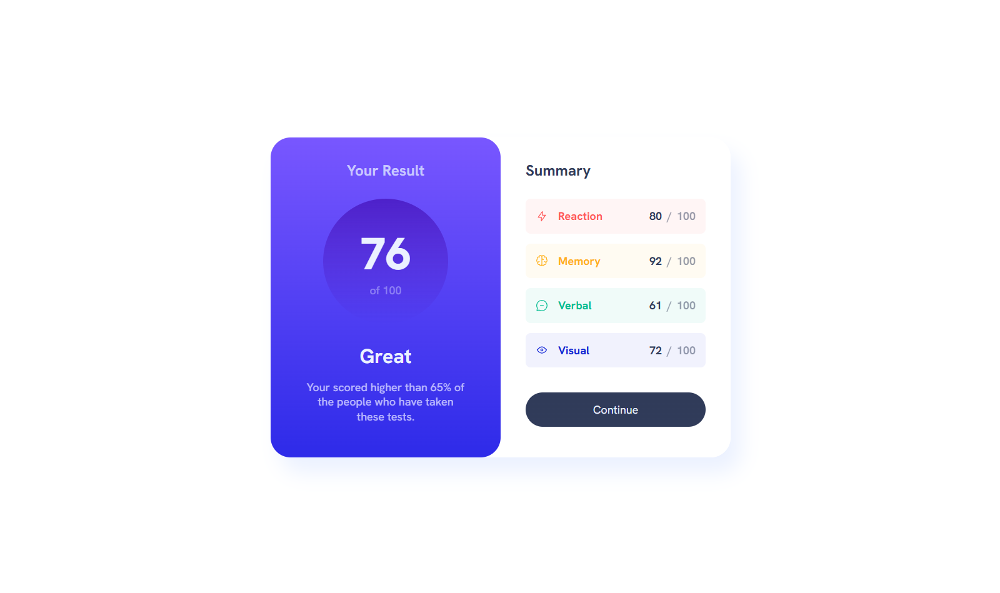

# Results summary component solution by Grimm-N
Responsive section Results summary component (HTML, SASS, JavaScript)

This is a solution to the [Results summary component challenge on Frontend Mentor](https://www.frontendmentor.io/challenges/results-summary-component-CE_K6s0maV).

## Table of contents

- [Overview](#overview)
  - [The challenge](#the-challenge)
  - [Screenshot](#screenshot)
  - [Links](#links)
- [My process](#my-process)
  - [Built with](#built-with)
  - [What I learned](#what-i-learned)
  - [Continued development](#continued-development)
- [Author](#author)

## Overview

### The challenge

Users should be able to:

- View the optimal layout for the interface depending on their device's screen size
- See hover and focus states for all interactive elements on the page
- **Bonus**: Use the local JSON data to dynamically populate the content

### Screenshot

### Links

- Solution URL: [Solution](https://www.frontendmentor.io/solutions/results-summary-ui-with-scss-html-and-json-integration-HBkdsiGCVn)
- Live Site URL: [Live site](https://grimm-n.github.io/results-summary-component/)

## My process

### Built with

- Semantic HTML5 markup
- CSS custom properties
- Flexbox
- CSS Grid
- SCSS
- JavaScript
- Json fail

### What I learned

Well, let’s just say I’ve got a pretty solid grip on most things... except maybe animations that look smooth and not like a choppy robot dance. 💃🤖 If someone could show me the secret sauce to flawless transitions, that would be awesome. Also, making sure my CSS is clean and not a spaghetti monster would be a dream come true. 🍝🎨

And hey, if you’ve got magical debugging skills, I’m all ears. My console and I are getting a bit too comfortable together. 😆🔍

### Continued development

Use this section to outline areas that you want to continue focusing on in future projects. These could be concepts you're still not completely comfortable with or techniques you found useful that you want to refine and perfect.

## Author

- LinkedIn - [Natali Grimm](https://www.linkedin.com/in/grimm-n/)
- Frontend Mentor - [@Grimm-N](https://www.frontendmentor.io/profile/Grimm-N)
- Twitter - [@Grimm__N](https://x.com/Grimm__N)
